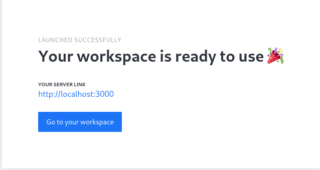
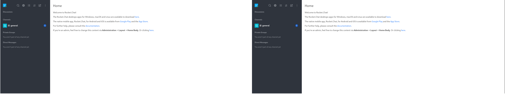
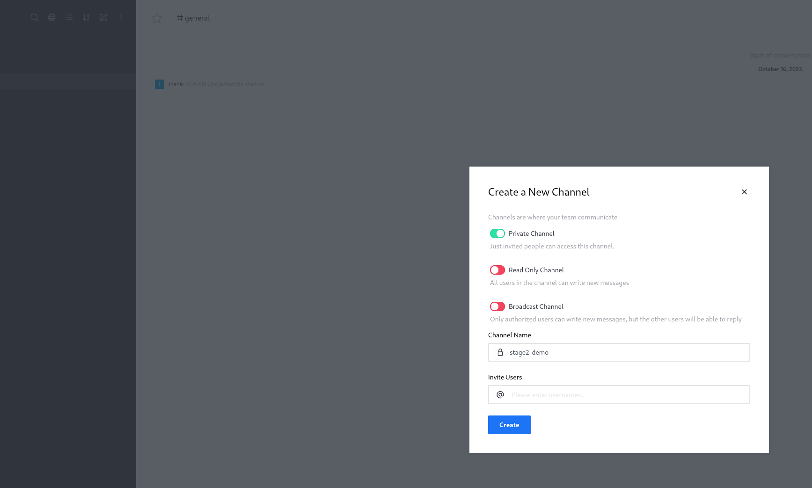
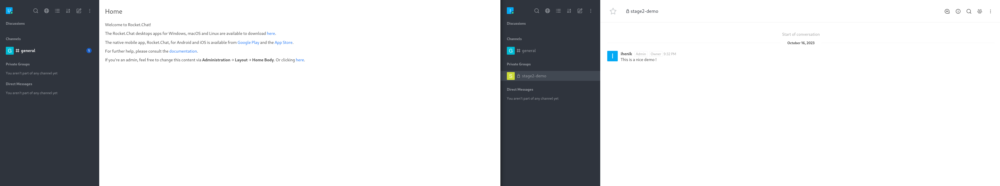
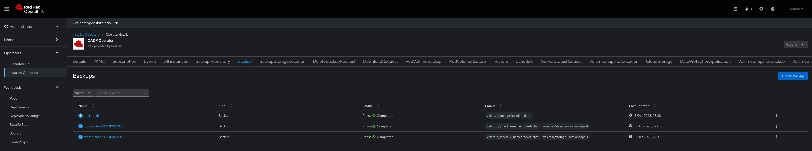
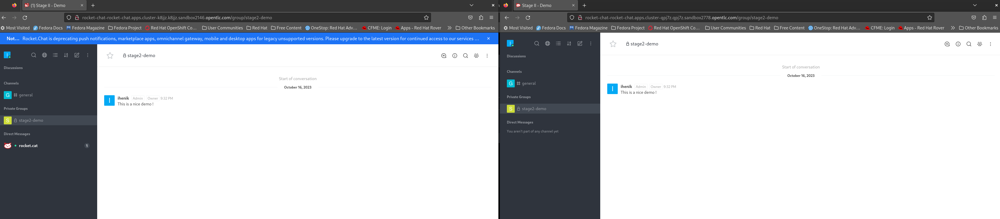

# Stage 2: Backup and Restore RocketChat between OpenShift Clusters using OADP

In this stage, you will learn how to backup and restore a RocketChat application between two OpenShift clusters using the OADP (OpenShift Application Data Protection) Operator. This scenario demonstrates the importance of data protection and disaster recovery in a multi-cluster environment.

## Prerequisites

Before you begin, ensure you have the following prerequisites in place:

- Access to two OpenShift clusters with an admin premissions: a source cluster and a target cluster.
- The OADP Operator installed on both clusters.
- DataProtectionApplication CR is created and BackupStorageLocation is available at the Primary cluster.
- S3 access.

## Scenario I

At this scenario we will backup manually the application from the primary cluster and restore it at the passive cluster.

### 1. Deploy RocketChat on the Source Cluster


1.1. Apply the YAML file to deploy the RocketChat application on the source cluster:
   ```bash
   git clone && cd stage2
   oc apply -f manifests/manifest.yaml
   ```
1.2 Setup the application.
   ```bash
   oc get route rocket-chat -n rocket-chat -ojsonpath="{.spec.host}"
   ```
   Insert the URL and keep with the setup guidelines.

   
  Hit on 'Enter' to continue and keep a head with the guidelines.


### 2.Backup RocketChat from the Source Cluster
2.1 At this step, you have to create a Backup CR which will backup the required application.
```bash
oc apply -f Backup.yaml
```
Backup.yaml:

```yaml
apiVersion: velero.io/v1
kind: Backup
metadata:
  annotations:
    velero.io/source-cluster-k8s-gitversion: v1.25.12+ba5cc25
    velero.io/source-cluster-k8s-major-version: '1'
    velero.io/source-cluster-k8s-minor-version: '25'
  name: backup-demo-rocket-chat
  namespace: openshift-adp
  labels:
    velero.io/storage-location: dpa-1 #Location created by DPA's CR
spec:
  csiSnapshotTimeout: 10m0s
  defaultVolumesToFsBackup: true
  includedNamespaces: #Namespace it will backup
    - rocket-chat
  itemOperationTimeout: 1h0m0s
  storageLocation: dpa-1
  ttl: 720h0m0s
  volumeSnapshotLocations:
    - dpa-1
```
### 3. Configure the passive cluster
3.1 Install OADP - you can use the guidelines from stage I
3.2 Create Credentails secret for OADP operator to use.

```bash
oc create secret generic cloud-credentials --namespace openshift-adp --from-file cloud=secret.yaml
```
secret.yaml:

```yaml
[default]
aws_access_key_id=<INSERT_VALUE>
aws_secret_access_key=<INSERT_VALUE>
```
3.3 Create DataProtectionApplication (DPA) CR:
```bash
oc apply -f DataProtectionApplication.yaml
```
DataProtectionApplication.yaml:
### change the prefix name
```yaml
apiVersion: oadp.openshift.io/v1alpha1
kind: DataProtectionApplication
metadata:
  name: dpa
  namespace: openshift-adp
spec:
  backupLocations:
    - velero:
        config:
          profile: default
          region: eu-west-1
        credential:
          key: cloud
          name: cloud-credentials #Secret name we created earlier
        default: true
        objectStorage:
          bucket: backup-demo-ihenik #BucketName
          prefix: stage1 #PrefixName
        provider: aws
  configuration:
    restic:
      enable: true
    velero:
      defaultPlugins:
        - openshift
        - aws
        - csi
  snapshotLocations:
    - velero:
        config:
          profile: default
          region: eu-west-1
        provider: aws
```
3.4 Modify VolumeSnapShotClass

The Velero CSI plugin, to backup CSI backed PVCs, will choose the VolumeSnapshotClass in the cluster that has the same driver name and also has the velero.io/csi-volumesnapshot-class: "true" label set on it.

```bash
oc patch volumesnapshotclass <volumesnapshotclass-name> --type=merge -p '{"deletionPolicy": "Retain"}'
oc label volumesnapshotclass <volumesnapshotclass-name> velero.io/csi-volumesnapshot-class="true"
```
Great, now that all set we should be able to see under 'Backup' tab the backup we created at step 2.

[BackupIMAGE]

### 4. Preform a Restore at the passive cluster
4.1 You know what to do now, In order to restore the backup you have to create a 'Restore' CR:
```bash
oc apply -f Restore.yaml
```
Restore.yaml:

```yaml
apiVersion: velero.io/v1
kind: Restore
metadata:
  name: restore-rocket-chat
  namespace: openshift-adp
spec:
  backupName: backup-demo-rocket-chat #Name of the backup you created eariler
  excludedResources:
    - nodes
    - events
    - events.events.k8s.io
    - backups.velero.io
    - restores.velero.io
    - resticrepositories.velero.io
    - csinodes.storage.k8s.io
    - volumeattachments.storage.k8s.io
    - backuprepositories.velero.io
  includedNamespaces:
    - rocket-chat #Restore mentioned NS
  itemOperationTimeout: 1h0m0s
  restorePVs: true #Restore the PVs as well
```
If you navigate to the application namespace (rocket-chat) you will see the following mess:
[image-mess]
But why? When OADP execute a restore-flow the 'restore-controller' follows a 'existingUpdatePolicy',by default if the controller dedcted that object exists it will skip.
In this case we should change the policy value to 'update' which means the controller will update the exisiting resources.

There is more...as you proably know an application might have pre-configuration tasks to function properly.
That's why each backup need to be characterized carefully !

In our example the mongo-db must initiate a replica set named "rs0" with a single member.
To accomplish that requirement we can use 'restore-hooks', the hook will execute the mentioned command AFTER the restore completed inside a specific container.

4.2 Now after we learn few things let's deploy the Restore in the right way:
```bash
oc apply -f Restore.yaml
```
Restore.yaml:

```yaml
apiVersion: velero.io/v1
kind: Restore
metadata:
  name: restore-rocket-chat
  namespace: openshift-adp
spec:
  hooks:
    resources:
      - includedNamespaces:
          - rocket-chat
        labelSelector:
          matchExpressions:
            - key: posthook
              operator: Exists
        postHooks:
          - exec:
              command:
                - /bin/sh
                - '-c'
                - >-
                  sleep 60 && mongo rocket-chat-db:27017 --eval
                  "rs.initiate({_id: 'rs0', members: [{_id:0,
                  host:'localhost:27017'}]})"
              execTimeout: 1m
              waitTimeout: 5m
              onError: Fail
              container: rocketchat-db # which contianer to execute the hook on
        name: restore-hook-1
  backupName: backup-demo-rocket-chat
  existingResourcePolicy: update # if mentioned it will update resources and not skip if exsist
  restorePVs: true # allow to restore pvs
```
Now if you navigate to the app's routes in each cluster you need to see the following state:


Excellent ! but what happen when the application writes more data for the volume ? to execute this all procedure manaully is discouraging..

Let's see how to deal with that in the next scenriao
## Scenario II
As mentioned above applications nativley writes new-data,changing or deleting old data and to backup manually seems not to be so effcicent, of course if we talking about active-passive architecture we defntility dont wont to restore each compenonet manually.
So how we deal with it ? At this scenario we will preform a 'scheduled' backup and restore.

Let's create some data by creating a new channel and some messeages:



Now we have two un-synced applications:



### 1. At the primary cluster create a Schedule CR
```bash
oc apply -f Schedule.yaml
```
Schedule.yaml:

```yaml
  apiVersion: velero.io/v1
  kind: Schedule
  metadata:
    name: rocket-chat
    namespace: openshift-adp
  spec:
    schedule: '*/20 * * * * ' #schedule time
    template:
      defaultVolumesToFS: true
      hooks: {}
      includedNamespaces:
        - rocket-chat
      storageLocation: dpa-1
      ttl: 720h0m0s #backup-expried time
```
After creating this CR a backup will created schedually by the time-period you mentioned.


### 2. Creating a scheduled Restore at the passive-cluster

Unfortunately OADP not able to schedule a restore but don't worry because god created the cronjobs :)
2.1 Create a crobjob to restore schedullay the newest backup:
```bash
oc apply -f CronJob.yaml
```
CronJob.yaml:
```yaml
kind: CronJob
apiVersion: batch/v1
metadata:
  name: rocket-chat-updater
  namespace: openshift-adp
spec:
  schedule: '*/25 * * * *'
  concurrencyPolicy: Allow
  suspend: false
  jobTemplate:
    metadata:
      creationTimestamp: null
    spec:
      template:
        metadata:
          creationTimestamp: null
        spec:
          containers:
            - name: restore-schedule
              image: bitnami/kubectl
              command:
              - "/bin/sh"
              - "-c"
              - |
                # Capture the newest backup name
                NEWEST_BACKUP_NAME=$(kubectl get backups -n <your-namespace> --sort-by=.metadata.creationTimestamp -o json | jq -r '.items[-1].metadata.name')

                # Create the Velero Restore CR with the captured backup name as the backupName
                cat <<EOF | kubectl apply -f -
                apiVersion: velero.io/v1
                kind: Restore
                metadata:
                  name: restore-rocket-chat
                  namespace: openshift-adp
                spec:
                  backupName: $NEWEST_BACKUP_NAME
                  # Rest of your Velero Restore CR specification
                   hooks:
                      resources:
                        - includedNamespaces:
                            - rocket-chat
                          labelSelector:
                            matchExpressions:
                              - key: posthook
                                operator: Exists
                          postHooks:
                            - exec:
                                command:
                                  - /bin/sh
                                  - '-c'
                                  - >-
                                    sleep 60 && mongo rocket-chat-db:27017 --eval
                                    "rs.initiate({_id: 'rs0', members: [{_id:0,
                                    host:'localhost:27017'}]})"
                                execTimeout: 1m
                                waitTimeout: 5m
                                onError: Fail
                                container: rocketchat-db # which contianer to execute the hook on
                          name: restore-hook-
                    existingResourcePolicy: update # if mentioned it will update resources and not skip if exsist
                    restorePVs: true # allow to restore pvs
                EOF
              resources: {}
              terminationMessagePath: /dev/termination-log
              terminationMessagePolicy: File
              imagePullPolicy: Always
          restartPolicy: OnFailure
          terminationGracePeriodSeconds: 30
          dnsPolicy: ClusterFirst
          serviceAccountName: velero
          serviceAccount: velero #use velero serviceaccount or create you own
          securityContext: {}
          schedulerName: default-scheduler
  successfulJobsHistoryLimit: 3
  failedJobsHistoryLimit: 1

```
If a disaster will happend, you're are now ready for it !
Every 25 mintues a new restore will be triggred, the restore will trigger a post-hook and as result we will recive an active-passive sync between the apps.


NOTE In production environments we will configure a Global Load Balancer between the apps to achive seamless expriment for our customers.

So far, you accomplished basic statefulsets backups and restores, locally and among clusters, you impmeneted a schedule machnisim in order to achive active-passive sync
If you feel ready to escalte the scenrio and to fully backup and restore clusters and cluster-hubs continue to the next stage :)
