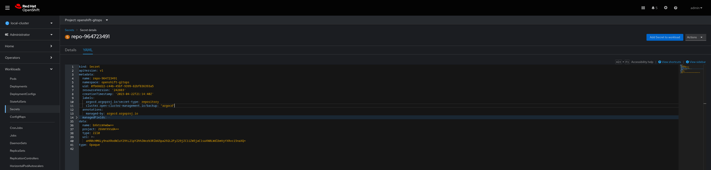
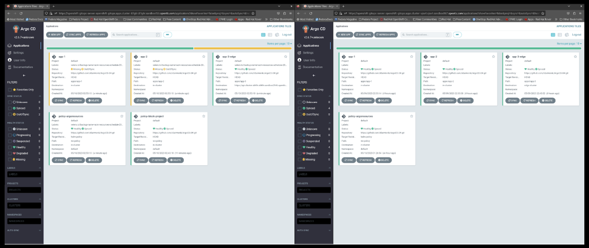

# Stage 3: Backup and Restore between Management Hub Clusters using ACM, RHGitops Operator, and OADP

In this stage, we will demonstrate how to backup and restore an applications and cluster-data between two Management Hub clusters using ACM (Advanced Cluster Management), RHGitops Operator, and OADP (OpenShift Application Data Protection).

## Intro

At the previous stages we backups and restore applications at local cluster and also between two remoted clusters using OADP, at this stage we will use 'cluster-backup-operator'.

The Cluster Back up and Restore Operator runs on the Red Hat Advanced Cluster Management for Kubernetes hub and depends on the OADP Operator to create a connection to a backup storage location on the hub, which is then used to backup and restore user created hub resources.
The operator defines the 'BackupSchedule.cluster.open-cluster-management.io' resource, used to setup Red Hat Advanced Cluster Management for Kubernetes backup schedules, and the R'estore.cluster.open-cluster-management.io' resource, used to process and restore these backups. The operator sets the options required to backup remote clusters configuration and any other hub resources that need to be restored.
[image of operator flows]

To more addtional information about the 'cluster-backup-operator' [click here](https://github.com/stolostron/cluster-backup-operator#getting-started)

## Prerequisites

- Two Management Hub clusters (source and target) set up.
- Admin premissions on both hub clusters.
- ACM, RHGitops Operator, and OADP installed on both clusters.
- S3 access


## Step-by-Step Guide

### 1. Enable the cluster-backup-operator at the active & the passive clusters
you can enable the installation of the cluster backup and restore operator chart by setting the cluster-backup option to true on the MultiClusterHub resource


### 2. Create a connection to a backup storage location

2.1. Create Credentails secret for OADP operator to use.

```bash
oc create secret generic cloud-credentials --namespace openshift-adp --from-file cloud=secret.yaml
```
secret.yaml:

```yaml
[default]
aws_access_key_id=<INSERT_VALUE>
aws_secret_access_key=<INSERT_VALUE>
```
2.2 Create DataProtectionApplication to connect the OADP to the S3:
```bash
oc apply -f DataProtectionApplication.yaml
```
DataProtectionApplication.yaml:

```yaml
apiVersion: oadp.openshift.io/v1alpha1
kind: DataProtectionApplication
metadata:
  name: dpa
  namespace: openshift-adp
spec:
  backupLocations:
    - velero:
        config:
          profile: default
          region: eu-west-1
        credential:
          key: cloud
          name: cloud-credentials #Secret name we created earlier
        default: true
        objectStorage:
          bucket: backup-demo-ihenik #BucketName
          prefix: stage3 #PrefixName
        provider: aws
  configuration:
    restic:
      enable: true
    velero:
      defaultPlugins:
        - openshift
        - aws
        - csi
  snapshotLocations:
    - velero:
        config:
          profile: default
          region: eu-west-1
        provider: aws
```
### 3. Create a Scheduled Backup at the active-cluster for passive-data
In our cluster we using Gitops method therefore our Argo-CD instance are responsible for applications deployment.
The following scenrio we will backup our Argo-CD instace which will deploy all the other stateless applications at the passive cluster.

Important to know that the 'cluster-backup-operator' backs up all custom resource definitions from the following API groups: 

    argoproj.io
    app.k8s.io
    core.observatorium.io
    hive.openshift.io

Note: The OADP Operator does not back up repositories, ConfigMaps, and secrets of Argo CD, which are necessary for Disaster Recovery configuration (Users, repositories for Applications, Access to external clusters, etc.). Therefore, you must label the custom resource definition to make sure the resources are a part of the backed-up components.

3.1 Locate all Argo CD custom resources you want to back up, such as secrets, ConfigMaps, appProjects, and anything else related to custom resources. After you locate these, label them as cluster.open-cluster-management.io/backup: "argocd" for the OADP Operator to identify. Labeling assures that the resource is part of the passive data backup


3.2 Label your Argo CD custom resources using the RHACM console, the oc label command
```bash
oc label <resource-name> -n <resource-namespace> cluster.open-cluster-management.io/backup: "argocd"
```
NOTE you can also label to exlcude resources for example 'velero.io/exclude-from-backup: "true"'

3.3 Create the 'BackupSchedule' resource on the active cluster and in the open-cluster-management namespace
```bash
oc apply -f BackupSchedule.yaml
```
BackupSchedule.yaml
```bash
apiVersion: cluster.open-cluster-management.io/v1beta1
kind: BackupSchedule
metadata:
  name: schedule-backup
spec:
  veleroSchedule: 0 */2 * * *
  veleroTtl: 120h
  useManagedServiceAccount: false
  ```


### 4. Restore at the passive-cluster

4.1 Prior to initiating the restoration process, it is of utmost importance to ensure the prevention of any potential race conditions during the execution of the restoration flow. In our specific scenario, we are tasked with transferring data from one Argo CD instance to another, with the primary goal of avoiding issues such as race conditions that may arise between the passive and active clusters of Argo CD. To address this concern, it is advisable to establish a synchronization policy within your passive cluster. You may also leverage a policy I have specifically crafted for situations of this nature
```bash
oc create -f https://github.com/IdanHenik/argocd-dr/blob/main/Passive-Cluster/OCM-policy/policy.yaml
```
policy uses Open Cluster Management to mutate and locate any custom resource that matches kind: AppProject, and modify it to contain the SyncWindow block type, which is scheduled for day (24h). This stops syncs on the passive cluster. View the following images that show there is no sync from the console


4.2 We are now ready and set to restore the passive data, let take a look at the diffrence between the instace pre-restore


```bash
oc apply -f Restore.yaml
```
Restore.yaml
```bash
apiVersion: cluster.open-cluster-management.io/v1beta1
kind: Restore
metadata:
  name: restore-passive-sync
spec:
  syncRestoreWithNewBackups: true
  restoreSyncInterval: 15m
  cleanupBeforeRestore: CleanupRestored
  veleroManagedClustersBackupName: skip
  veleroCredentialsBackupName: latest
  veleroResourcesBackupName: latest
```
Based on the previous Restore resource, the latest BackupStorageLocation resource is restored every 15 minutes. After restoring the first backup, you should see that all resources transferred successfully and that AppProjects resources now have the SyncWindow status. Open the passive Argo CD instance and see what happened. 



### 5. Restore the active-data
In the event of a catastrophic situation rendering the primary hub non-functional, it becomes imperative to initiate the restoration process for a substantial amount of critical data to transition our passive cluster into an active state. A prime example of such essential data includes the configurations of the managed clusters.

By default Resources are backed up in 3 separate groups:

    1.credentials backup - one backup file, storing hive, ACM and user created secrets and configmaps
    2.resources backup - 2 backup files, one for the ACM resources and second for generic resources, labeled with cluster.open-cluster-management.io/backup
    3.managed clusters backup, schedule labeled with cluster.open-cluster-management.io/backup-schedule-type: acm-managed-clusters - one backup containing only resources which result in activating the managed cluster connection to the hub where the backup was restored on

5.1 In order to restore an active-data, change the 'veleroManagedClustersBackupName: latest' instead of skip.
```bash
oc apply -f Restore-active.yaml
```

Restore-active.yaml
```bash
apiVersion: cluster.open-cluster-management.io/v1beta1
kind: Restore
metadata:
  name: restore-active-sync
spec:
  syncRestoreWithNewBackups: true
  restoreSyncInterval: 15m
  cleanupBeforeRestore: CleanupRestored
  veleroManagedClustersBackupName: latest
  veleroCredentialsBackupName: latest
  veleroResourcesBackupName: latest
```


Congratulations! You completed the restore process. To set the passive cluster as active, make sure the current active cluster is not available, then remove the policy and the Restore resource. Create a ScheduledBackup resource. If you want to revert the change, just complete this procedure again.
